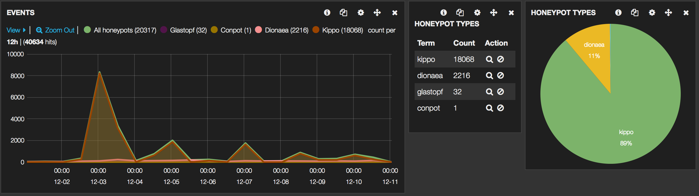
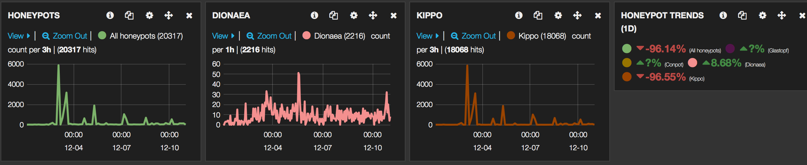
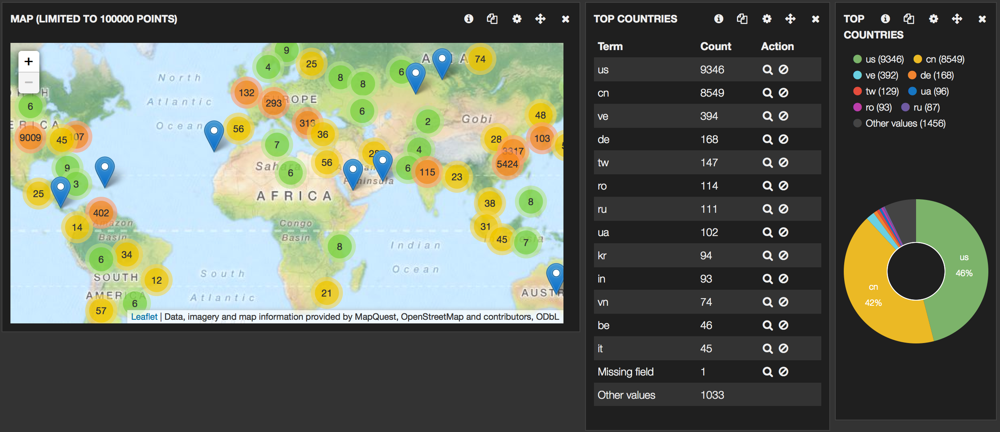
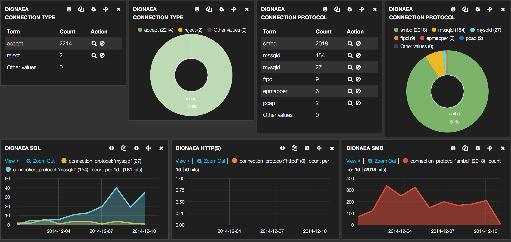
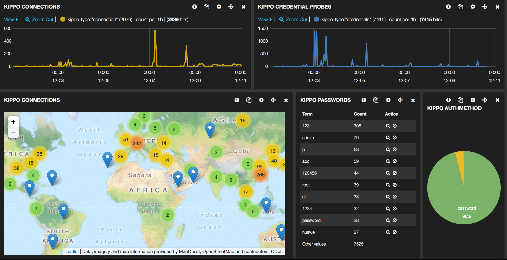
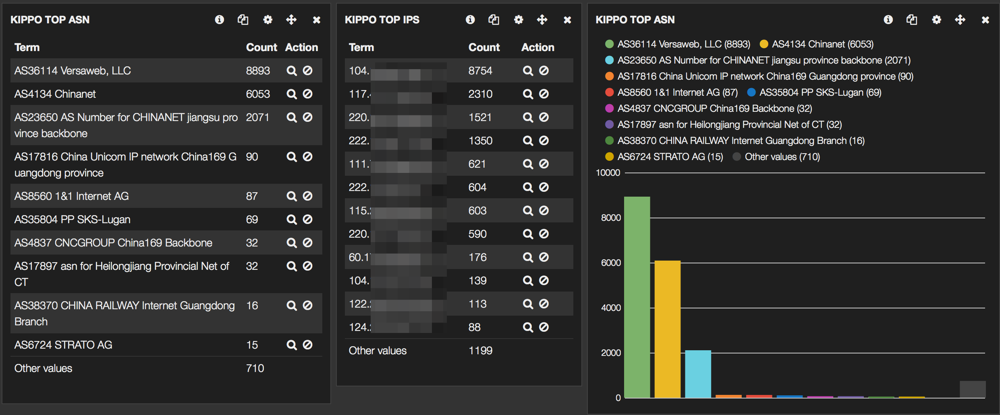

# ELK

The Elasticsearch ELK Stack (Elasticsearch, Logstash and Kibana) is an ideal solution for a search and analytics platform on honeypot data.

See http://www.vanimpe.eu/2014/12/13/using-elk-dashboard-honeypots/ for a detailed overview.








# Dionaea

Use the patch from dionaea/logsql.py to keep track of changes in the sqlite database.
Make sure you alter the sqlite database

```
sqlite> alter table connections add column id integer;
```

# Tips

* Use "geoip.full.raw" to prevent split string data 
* curl -XDELETE 'http://localhost:9200/logstash-*'

# ELK basic Setup

mkdir /data
cd /data
wget https://download.elastic.co/elasticsearch/elasticsearch/elasticsearch-1.7.1.tar.gz
tar zxvf elasticsearch-1.7.1.tar.gz
ln -s elasticsearch-1.7.1 elasticsearch
wget https://download.elastic.co/logstash/logstash/logstash-1.5.3.tar.gz
tar zxvf logstash-1.5.3.tar.gz
ln -s logstash-1.5.3 logstash

